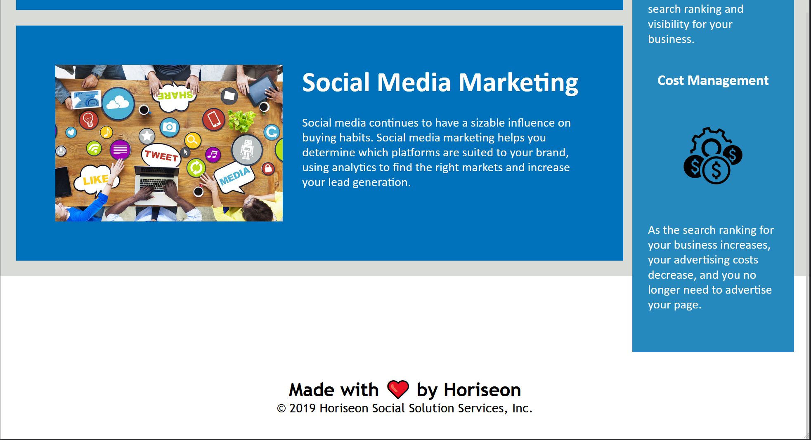

# HTML Challenge 01 

## Description 
    The goal of this project was to clean up the code base and replace redundant code with semantic elements that doesn't break the exisiting code.

    * motivation was to clean up the code as much as possible without breaking anything.
    * I built this project to learn more about semantic elements and how to not write redundant code.
    * it solves the problem of having cleaner and easier code to read.
    * I learned how to make little changes and check my work as I go so I don't have to perform a lot of break fixes for a mistake.

## Installation 

No steps to install application as it should be hosted on Github with working URL

## Usage

Should be able to access URL at GitHub and should look like the screenshot below.

## Credits 

I've worked on this myself as part of the HTML Challenge

